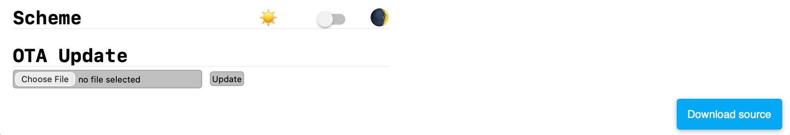

# Source Archive Component

The `source_archive` component embeds the configuration a device was built from into the
firmware itself and serves it back as a single ZIP archive over the
[Web Server](https://esphome.io/components/web_server/).

A node flashed a year ago can then tell you exactly what produced the binary it is
running, without you having to guess which revision of which YAML file was on your laptop
at the time. The archive is assembled at compile time and stored in flash, so it always
matches the running firmware.

> [!NOTE]
> Requires ESPHome 2026.2.0 or newer, and the
> [Web Server](https://esphome.io/components/web_server/) component.

<!-- screenshot: device web interface with the Download source button -->

```yaml
# Example configuration entry
external_components:
  - source: github://borisfeldman/source-archive@v1.2.0
    components: [source_archive]
    refresh: never

web_server:

source_archive:
  filename: bedroom-lamp-source.zip
  files:
    - packages/wifi.yaml
    - packages/sensors.yaml
```

Browsing to `http://bedroom-lamp.local/source.zip` now downloads `bedroom-lamp-source.zip`,
containing `bedroom-lamp.yaml`, both packages and a manifest.

## Configuration variables

- **files** (*Optional*, list of files): Additional files to embed in the firmware. Paths
  are relative to the configuration directory and are kept as-is inside the archive.
- **include_current_config** (*Optional*, boolean): Also embed the YAML file being
  compiled. Defaults to `true`.
- **download_path** (*Optional*, string): The URL path the archive is served from. Must be
  absolute and must not contain a query string or fragment. Defaults to `/source.zip`.
- **filename** (*Optional*, string): The name the browser saves the download as. Must end
  in `.zip` and use only letters, digits, dots, dashes and underscores. Defaults to
  `esphome-source.zip`.
- **max_size** (*Optional*, bytes): Refuse to build if the compressed archive grows beyond
  this size. Defaults to `64kB`.
- **download_button** (*Optional*, boolean): Add a **Download source** button to the device
  web interface. Defaults to `false`.
- **id** (*Optional*, [ID](https://esphome.io/guides/configuration-types#id)): Manually
  specify the ID used for code generation.

> [!NOTE]
> Packages pulled in with `!include` are not discovered automatically. ESPHome resolves
> them into a single configuration long before this component runs, so every file you want
> in the archive has to be named in `files:`.

A device built from a single YAML file needs no `files:` at all — the configuration being
compiled is archived on its own:

```yaml
source_archive:
```

Something has to end up in the archive, so setting `include_current_config: false` without
listing any `files:` is rejected.

Paths must stay inside the configuration directory: absolute paths and `..` are rejected,
and every file has to exist when the configuration is validated. Component sources fetched
by `external_components` live under `.esphome/` and therefore cannot be listed. Duplicates
are dropped, so naming the current configuration file explicitly alongside
`include_current_config: true` is harmless.

## Archive contents

Entries keep the relative paths you gave them, and a manifest is added last:

```
bedroom-lamp-source.zip
├── bedroom-lamp.yaml
├── packages/wifi.yaml
├── packages/sensors.yaml
└── SOURCE-MANIFEST.json
```

`SOURCE-MANIFEST.json` records the ESPHome version used for the build and a SHA-256 digest
for every entry:

```json
{
  "component_version": "1.2.0",
  "configuration": "bedroom-lamp.yaml",
  "esphome_version": "2026.7.3",
  "files": [
    {
      "path": "bedroom-lamp.yaml",
      "sha256": "3b1f0c9e…",
      "size": 1042
    }
  ],
  "format": 1
}
```

Entries are written with a fixed timestamp and fixed permissions, so identical inputs
always produce a byte-identical archive.

## Downloading the archive

```bash
curl -OJ http://bedroom-lamp.local/source.zip
unzip -l bedroom-lamp-source.zip
```

The response is sent as `application/zip` with `Content-Disposition: attachment`,
`Cache-Control: no-store` and `X-Content-Type-Options: nosniff`.

The manifest digests are for spotting drift rather than for checking the download — `unzip`
already verifies a CRC-32 per entry. Run them from your configuration directory to see
whether what is on disk still matches what the device is running:

```bash
cd ~/esphome
unzip -p bedroom-lamp-source.zip SOURCE-MANIFEST.json \
  | jq -r '.files[] | "\(.sha256)  \(.path)"' \
  | shasum -a 256 -c
```

```
bedroom-lamp.yaml: OK
packages/wifi.yaml: FAILED
packages/sensors.yaml: OK
```

Use `sha256sum -c` in place of `shasum -a 256 -c` on Linux.

## Adding a download button to the web interface

Set `download_button`, and a floating **Download source** button appears on the device page:

```yaml
web_server:

source_archive:
  download_button: true
  files:
    - packages/wifi.yaml
```

Nothing needs copying into your configuration directory. The component generates the button
script with your `download_path` already substituted, writes it into ESPHome's internal data
directory, and points `web_server`'s `js_include` at it during final validation. Change
`download_path` and the button follows.

ESPHome serves the script as `/0.js` alongside the regular web interface script, so the
standard UI keeps working.

The button fetches the archive and checks the response before saving it. If the device
answers with an error it turns red and reports **Source unavailable** rather than saving the
error response to disk; the reason is in the `title` attribute and the browser console.



### Wiring the script up yourself

`web_server` accepts exactly one `js_include`. If you already use it for your own script,
`download_button` fails validation rather than overwriting it — merge the button into your
script instead, starting from
[source_archive_link.js](components/source_archive/source_archive_link.js).

The same applies if you would rather manage the file yourself. Copy it next to your
configuration and point `js_include` at it, leaving `download_button` off:

```yaml
web_server:
  js_include: source_archive_link.js
```

`js_include` resolves relative to your configuration directory and cannot reach the script
that `external_components` downloads — that lives under ESPHome's data directory, in a
folder named after a hash of the repository URL and ref, so the path changes whenever you
bump the pin. Fetch a copy from the tag instead:

```bash
cd /config
curl -fsSLo source_archive_link.js \
  https://raw.githubusercontent.com/borisfeldman/source-archive/v1.2.0/components/source_archive/source_archive_link.js
```

Pointing `js_include` at a path that is not there fails validation before anything else
runs:

```
Could not find file '/config/components/source_archive/source_archive_link.js'.
```

On this route the path is yours to maintain: `DOWNLOAD_PATH` at the top of the script has to
match `download_path` by hand.

> [!IMPORTANT]
> A hand-wired `js_include` is independent of `source_archive:`. Including the script without
> configuring the component leaves a button on the page with nothing behind it: no
> `/source.zip` route is registered, so the request falls through to the web server's 404.

## Versioning

Releases are tagged `vMAJOR.MINOR.PATCH`. The public surface is the YAML schema and the
archive layout:

- **MAJOR** — a configuration that used to validate no longer does: an option renamed or
  removed, a new required option, or a changed default that alters what lands in the
  archive.
- **MINOR** — new optional options, or additions to `SOURCE-MANIFEST.json`.
- **PATCH** — fixes that leave both the schema and the archive layout alone.

Pin to a tag, and set `refresh: never` so ESPHome stops re-checking the repository:

```yaml
external_components:
  - source: github://borisfeldman/source-archive@v1.2.0
    components: [source_archive]
    refresh: never
```

This matters more here than for most components. An unpinned source tracks the default
branch and refreshes daily, so a configuration recovered from an archive may fail to
validate against a later release — the archive would preserve your YAML perfectly and still
leave you unable to rebuild it. Because the archive stores that YAML verbatim, a pin
travels inside it: the recovered configuration asks for the exact component version that
built the firmware.

The component's own source cannot be archived — `external_components` places it under
`.esphome/`, outside the configuration directory, where [files](#configuration-variables)
is not allowed to reach. `SOURCE-MANIFEST.json` records the version instead, which is what
tells you which tag to pin if the configuration never was:

```json
{
  "component_version": "1.2.0",
  "esphome_version": "2026.7.3",
  "format": 1
}
```

`format` versions the manifest layout itself, independently of the component release.

## Logs

ESPHome reports what went into the firmware while compiling:

```
INFO source_archive 1.2.0 embedded 3 files in bedroom-lamp-source.zip (2847 bytes)
```

and the device repeats it on boot:

```
[C][source_archive:060]: Source Archive:
[C][source_archive:061]:   Download path: /source.zip
[C][source_archive:062]:   Filename: bedroom-lamp-source.zip
[C][source_archive:063]:   Size: 2847 bytes
```

## Flash usage

The archive is stored as a constant byte array in flash, so it costs exactly the compressed
size reported above. Entries are deflated at maximum compression; YAML packs down well and
even a large configuration with several packages lands in single-digit kilobytes —
negligible next to the several hundred kilobytes of an ESPHome binary, and not something
that needs weighing against other features.

The `max_size` limit exists to catch the case where that stops being true — a font, an
image directory or a stray binary picked up by a broad `files:` list. The default of `64kB`
is roughly ten times what a large YAML-only configuration produces, and small enough to
matter on a 1 MB ESP8266 where an OTA slot leaves little headroom. Going over it fails the
build:

```
Source archive is 91204 bytes, over the 64000 byte 'max_size' limit. Drop entries
from 'files', or raise 'max_size' if the firmware has room for it.
```

Raise it deliberately when the space is genuinely there:

```yaml
source_archive:
  max_size: 128kB
  files:
    - packages/wifi.yaml
```

## Security

> [!WARNING]
> The archive is served by `web_server`, which is unauthenticated by default. Anyone who
> can reach the device can download everything listed in `files:`.

- Listing `secrets.yaml` is rejected at validation time. Take the same care with any other
  file holding credentials, API keys or certificates — those are not detectable.
- Files are embedded byte for byte as they are on disk. `!secret` references and
  substitutions are *not* resolved, so the archive contains `!secret wifi_password` rather
  than the password itself — provided the secrets file is not in the list.
- `web_server` sends `Access-Control-Allow-Origin: *`, so a web page you visit while on the
  same network can read the archive cross-origin. This is
  [intentional in ESPHome](https://github.com/esphome/esphome/blob/dev/THREAT_MODEL.md) and
  applies to the whole web interface, but the archive makes your configuration part of what
  is reachable that way.
- Enable authentication if the device is on a network you do not fully trust. The download
  endpoint is registered through `add_handler()`, so it sits behind the same auth
  middleware as the rest of the web interface:

  ```yaml
  web_server:
    auth:
      username: !secret web_server_username
      password: !secret web_server_password
  ```

See [Security Best Practices](https://esphome.io/guides/security_best_practices/).

## See Also

- [sample.yaml](sample.yaml) — minimal configuration using this component
- [Web Server Component](https://esphome.io/components/web_server/)
- [External Components](https://esphome.io/components/external_components/)
